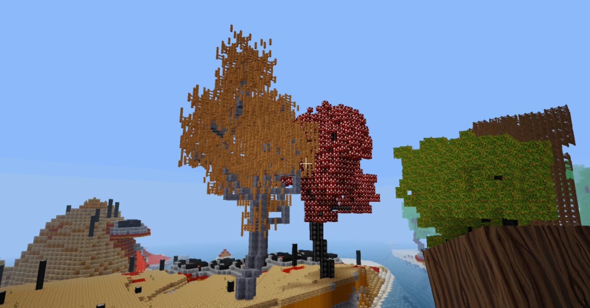

# minetest mod rnd_trees

This mod adds new kind of trees, that looks more naturally grow

## Information

Create naturally-growing trees from any material, Place one of the `trees` blocks. 
The tree will start growing immediately.

Foreground: stone and wooden fence, Background: Bone and ethereal mushroom

## Technical information

This mod added trees that looks like naturally grow, 
it only provides the nodes, but does not spawn by itselft any one at mapgen.

### Crafting

Blocks are:
- `trees:tree` - customizable growth pattern/materials
- `trees:aspentree` - roughtly equivalent to the default aspen tree
- `trees:pinetree` - approximate size/shape of default pine tree. The growth algorithm is best suited to deciduous tres, so it doesn't resemble the default version very well
- `trees:jungletree` - closely resembles the default jungle tree; can be as tall as an emergent jungle tree
- `trees:appletree` - a larger and more realistic apple tree
- `trees:acaciatree` - roughtly equivalent to the default acacia tree. Again, the growth algorithm does not work as well for this one

## Chat commands:

- `/trunkmat` - the trunks of all future trees grown from `trees:tree` will be made of the currently wielded block
- `/leafmat` - the leaves of all future trees grown from `trees:tree` will be made of the currently wielded block
- `/treespec <height> <trunk height> <branch length>` - all future trees grown from `trees:tree` will have an overall height of <height> blocks, branches starting above <trunk height> blocks and branches up to <branch length> blocks long.

Any of these values may be made negative to randomize the value near the given value; e.g. `/treespec -30 5 10` will cause future trees to be a random height near 30 blocks

Customizations are per user and persist across logins.

## LICENSE

This work is licensed under the Creative Commons Attribution-ShareAlike 4.0 International License. 
To view a copy of this license, visit http://creativecommons.org/licenses/by-sa/4.0/.

New code is mckaygerhard

The original work was made by https://github.com/ac-minetest/rnd_trees rnd1 and this just merged some commits from max davis of https://github.com/Max-Davy/rnd_trees

